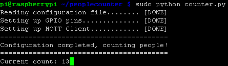

# peoplecounter
People counter built on the Raspberry Pi platform that gathers several metrics to be visualized in a BIRT report

# Data transmission
This project relies on the MQTT protocol to transport both the count with a timestamp as well as the analysis of the photos, also with timestamps.  The messages for both counting and photo analysis are sent as JSON strings in the following structure.

#### People Count Result ####
```
{
 "timestamp": " INT, 
 "counter": INT
}
```

#### Photo analysis ####
As of right now, I'm using the [SkyBiometry Face Detection and Recognition](https://www.mashape.com/skybiometry-1/skybiometry-face-detection-and-recognition) API.  Please note that I'm still in discovery on which API I want to use here.  For the time being this is a sample JSON result that will be published to MQTT after each photo.  This sample JSON result was taken from the [Mashape](https://www.mashape.com/skybiometry-1/skybiometry-face-detection-and-recognition) API page.  They have some really cool stuff there, if you haven't visited, then make sure to check them out. 

```
{
photos": [
        {
            "url": "http://tinyurl.com/673cksr",
            "pid": "F@0c95576847e9cd7123f1e304476b59ae_59ec9bb2ad15f",
            "width": 375,
            "height": 409,
            "tags": [
                {
                    "tid": "TEMP_F@0c95576847e9cd7123f1e304887741e1_59ec9bb2ad15f_56.80_41.08_0_1",
                    "recognizable": true,
                    "uids": [
                        {
                            "uid": "person0@MyNamespace",
                            "confidence": 18
                        },
                        {
                            "uid": "person1@MyNamespace",
                            "confidence": 16
                        },
                    ],
                    "confirmed": false,
                    "manual": false,
                    "width": 30.4,
                    "height": 27.87,
                    "center": {
                        "x": 56.8,
                        "y": 41.08
                    },
                    "eye_left": {
                        "x": 66.67,
                        "y": 34.47
                    },
                    "eye_right": {
                        "x": 50.67,
                        "y": 34.96
                    },
                    "mouth_center": {
                        "x": 61.07,
                        "y": 50.86
                    },
                    "nose": {
                        "x": 62.13,
                        "y": 42.3
                    },
                    "yaw": -16,
                    "roll": 0,
                    "pitch": 0,
                    "attributes": {
                        "face": {
                            "value": "true",
                            "confidence": 83
                        },
                        "gender": {
                            "value": "female",
                            "confidence": 18
                        }
                    }
                }
            ]
        }
    ],
    "status": "success",
    "usage": {
        "used": 1,
        "remaining": 9999,
        "limit": 10000,
        "reset_time_text": "Tue, 6 November 2012 22:30:53 +0000",
        "reset_time": 1352241053
    }
}

``` 

# Data persistence
This has yet to be implemented.  The working idea is that I will have an MQTT Client on my server.  As new JSON strings are published they will then be stored in Cassandra for persistence.  This is important since the point of this project is to show IoT data trends with foot traffic in a particular area.

# Data Visualization
The data visualization part will be self contained in a BIRT iHub 3.1 application.

# Raspberry Pi people counter backend


# Text to Voice
### OT 9000 "singing" Daisy
[](http://www.youtube.com/watch?v=Gn4GFsyke2I)
### OT 9000 on boot message
[](http://www.youtube.com/watch?v=0TmOMnpDcJs)
